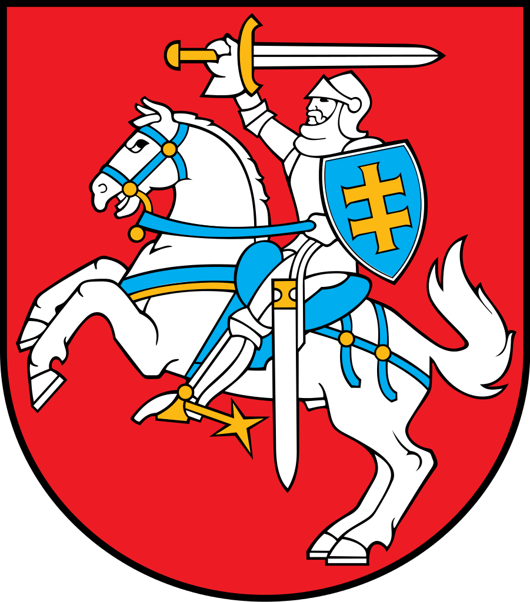

# The Constitution of the Republic of Lithuania - in a blockchain

### Lietuvos Respublikos Konstitucija

<i>Smart contract address on BSC blockchain:</i> <b>[0x054fd2FFd28bd6487a6f6F26dFcE996f4174d206](https://www.bscscan.com/address/0x054fd2FFd28bd6487a6f6F26dFcE996f4174d206)</b>

<i>ABI:</i> [Link To File](./ABI)

<i>Bytecode:</i> [Link To File](./bytecode)

<i>IPFS ID: QmcRDRh9czsAWnkvphH3ByM2KHGfFM3DbJqfNcM1Rs89qR </i>

This repository contains smart contracts and web front-end files for hosting using [IPFS](https://en.wikipedia.org/wiki/InterPlanetary_File_System).

The project data (Constitution of Lithuania) is intended to be stored in [Binance Smart Chain](https://www.binance.org/en/smartChain).

While the original idea was to use Ethereum blockchain, due to very high gas fees, we've found that Binance offers a great alternative.

### How it works

Take a visit to [https://lietuvos-respublikos-konstitucija.net](https://lietuvos-respublikos-konstitucija.net). At first, it looks like a traditional website.

However, the website assets, code and dependencies were stored in a decentralized file storage system - IPFS (InterPlanetary File System). 
This means, that the site does not have a server which serves the traffic, instead, the site just "floats" on two separate, decentralized systems that are distributed around the world.
 

### List of Chain ID's:

| `CHAIN_ID`     | Chain(s)                                   |
| ---------------| -------------------------------------------|
| 1              | Ethereum mainnet                           |
| 2              | Morden (disused), Expanse mainnet          |
| 3              | Ropsten                                    |
| 4              | Rinkeby                                    |
| 5              | Goerli                                     |
| 42             | Kovan                                      |
| 56             | Binance Smart Chain                        |
| 97             | Binance Smart Chain  Testnet                                |
| 1337           | Geth private chains (default)              |
